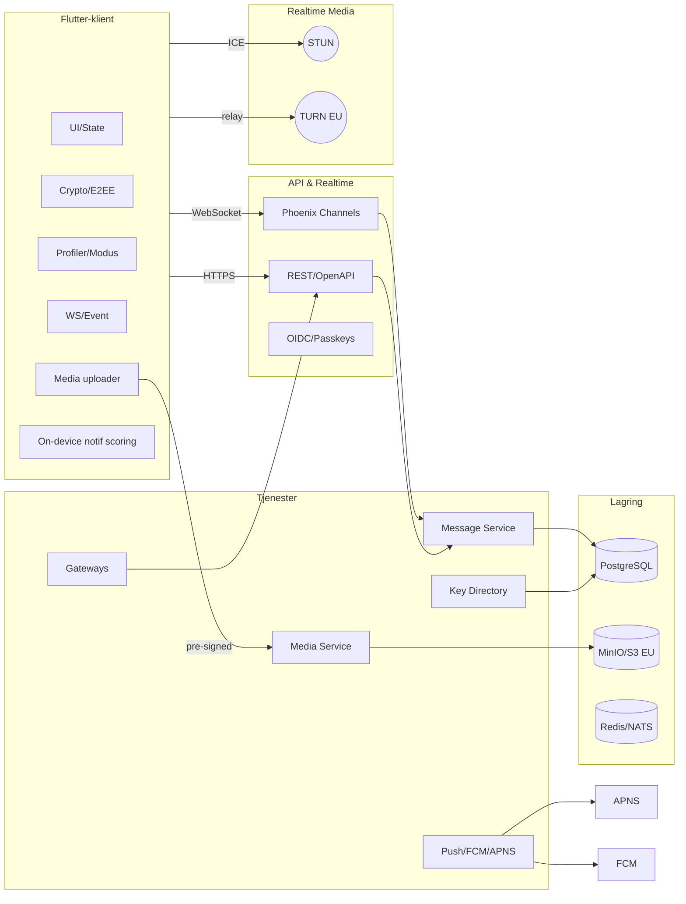
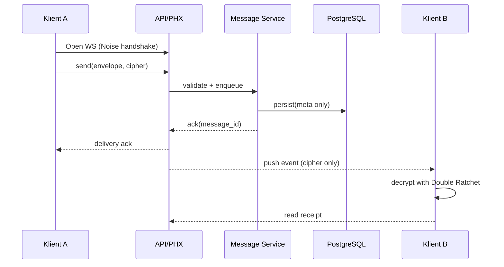
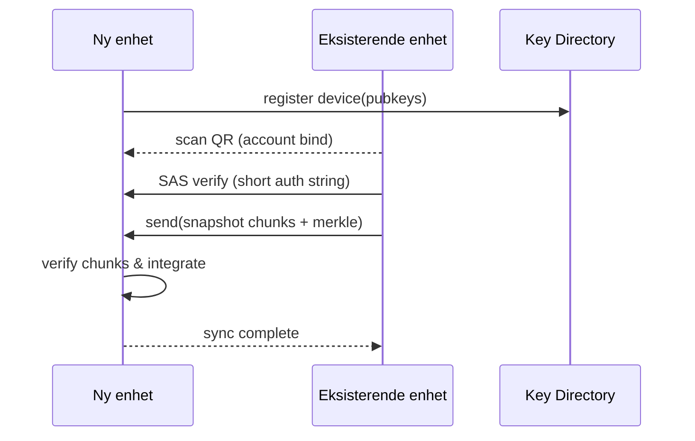
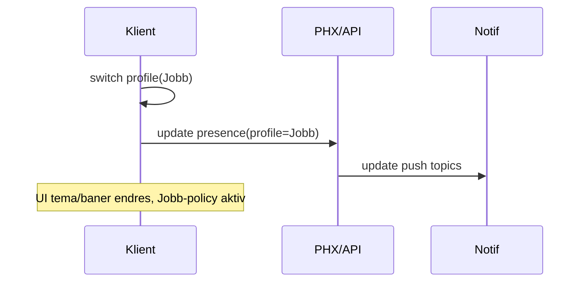
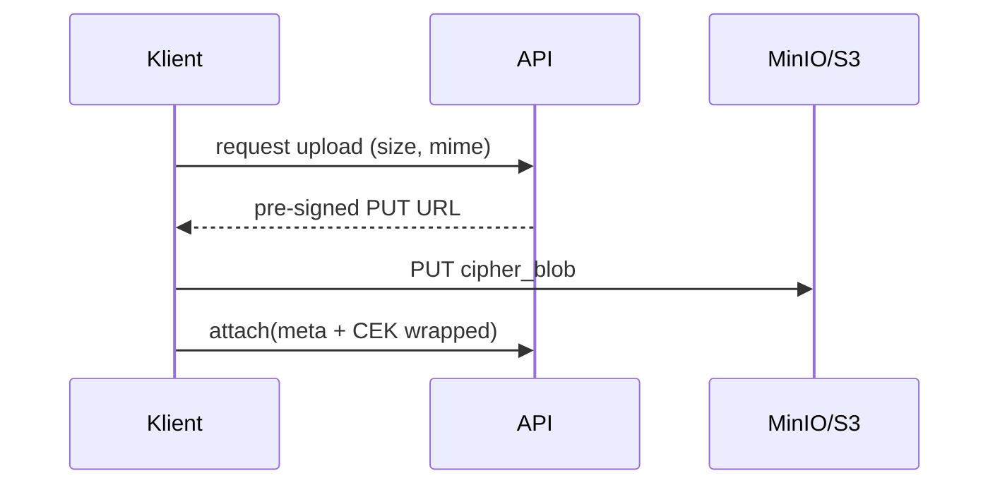

# architecture.md

## 1. Oversikt

En norsk/europeisk meldingstjeneste med sterk personvernprofil. Én konto → flere **profiler/moduser** (Privat/Jobb) med egne policyer, fargetema og notif-regler. Klient i **Flutter**; backend i **Elixir/Phoenix** (+ Go-mikroservices ved behov). Ende‑til‑ende‑kryptert (E2EE) meldinger med **Double Ratchet** over **Noise**-sikrede transportsesjoner (klient↔server og P2P). Lagring i Norge/EU (PostgreSQL + MinIO/S3).

## 2. Mål og ikke‑mål

**Mål**

* E2EE 1:1 og små grupper, stabil og rask i Norge/EU.
* Historikksynk mellom egne enheter, E2EE.
* Modus/Profiler (Privat/Jobb) med separate policyer/notifikasjoner/tema.
* Kanaler (enveis) og enkle gateway-integrasjoner (Slack webhook, Telegram bot).
* GDPR-first: dataplassering i NO/EU, ingen sporing.

**Ikke-mål (første 2 faser)**

* Full enterprise on‑prem (kommer senere).
* Komplett interoperabilitet mot WhatsApp/iMessage (avhengig av DMA/leverandør-API).

## 3. Høy‑nivå arkitektur

## 4. Komponenter

* **Client (Flutter)**: UI, profil/modus, on‑device notif‑scoring, lokal nøkkellager, historikksynk (D2D over QR/Nearby/P2P), WS-klient.
* **Phoenix Channels (Elixir)**: realtime signalisering, kø, autorisasjon per profil/rom.
* **REST/OpenAPI**: autentisering, profil/space, kanaloppsett, media pre‑sign.
* **Message Service**: persistens av metadata (ikke innhold), fan‑out, kvitteringer, rate‑limit.
* **Media Service**: pre‑signed S3/MinIO, thumbnail/virus‑scan pipeline (on‑prem EU).
* **Key Directory**: offentlig nøkkelinfo per konto/profil/enhet, attestasjonslogg.
* **Gateways**: Slack‑webhook inn, Telegram‑bot, (senere DMA‑broer).
* **Notif**: APNS/FCM; privacy‑bevisst payload (ingen innhold).

## 5. Sikkerhetsmodell (kort)

* **Transport**: Noise XX/IK mellom klient↔server; mTLS internt.
* **Meldinger**: Double Ratchet per samtale. Gruppesending med Sender Keys.
* **Nøkler**: Konto‑rot (seed) lagres kun lokalt; enhetsspesifikke nøkler; backup via brukerens hemmelige frase (valgfritt). Key Directory holder *kun* offentlige nøkler og attester.
* **Historikksynk (E2EE)**: D2D-overføring etter gjensidig bekreftet identitet (QR + short‑auth string), chunket + merkle‑røtter.
* **Media**: Innhold krypteres med tilfeldig kontentnøkkel (CEK) per fil; CEK wrap’es til hver mottaker.

## 6. Datamodell (forenklet)

* `account(id, created_at)`
* `profile(id, account_id, type[PRIVAT|JOBB], theme, policies)`
* `device(id, account_id, profile_whitelist[], pubkeys)`
* `space(id, kind[team|community], owner_profile_id)`
* `conversation(id, space_id?, kind[dm|group|channel])`
* `membership(profile_id, conversation_id, role)`
* `message(id, conversation_id, sender_profile_id, envelope(meta), cipher_blob_ref)`
* `attachment(id, message_id, object_key, cek_wrapped[])`

## 7. Sekvensdiagrammer

### 7.1 Send E2EE 1:1‑melding (via server)

### 7.2 Ny enhet + historikksynk (D2D)

### 7.3 Profilbytte og notif‑ruting

### 7.4 Media‑opplasting (pre‑signed)

## 8. Deploy & drift

* **Miljø**: dev/staging/prod i EU-region; MinIO i NO/EU; PG‑HA (Patroni) + read replicas.
* **Observability**: OpenTelemetry, Prometheus/Grafana, Sentry (klient/server), audit‑logger.
* **CI/CD**: Monorepo; kontrakt som single source (OpenAPI/JSON‑schema); codegen for Dart.

## 9. Skaleringsveier

* PG→Citus sharding for messages; kaldt arkiv i egen cluster.
* Media livssyklus (hot→warm→cold); dedup; CDN (EU‑edge).
* Gateway‑arbeidere horisontalt; WS‑noder med sticky‑sessions.

---

# product-spec.md

## 1. Produktmål

* Trygg, norsk meldingsapp med **én konto, flere profiler/moduser** (Privat/Jobb).
* Førsteklasses **E2EE** + praktisk **historikksynk**.
* **Kanaler** (enveis) og tidlige **gateway‑integrasjoner** for adopsjon.

## 2. Personas & Moduser

* **Privatbruker**: familie/venner, delt galleri, gjestetilgang.
* **Kunnskapsarbeider**: Jobb‑modus, tråder, notif‑regler, enkle integrasjoner.
* **Skaper/kanaleier**: Post til kanal, cross‑post, watermark.

**Profiler**

* *Privat*: lav friksjon, myke varsler, mørkt tema.
* *Jobb*: PIN/biometri, arbeidstid‑varsler, tydelig tema.

## 3. Omfang per fase (MoSCoW)

**MVP (Fase 1)**

* Must: Konto/profil, E2EE 1:1 + små grupper, media m/pre‑signed, historikksynk D2D, gjestetoken, tema.
* Should: “Chat med meg selv”, lesekvittering, enkle tråder.
* Could: Enkel kanal (kun tekst), QR‑parring UX.

**Fase 2**

* Must: Modus‑system fullført (notif/policy), kanaler v1, notif‑AI (on‑device).
* Should: Cross‑post, kanalmoderering.
* Could: Enkle stats for kanaleier.

**Fase 3**

* Must: Slack‑webhook, Telegram‑bot, team/workspace v1 + import Slack ZIP.
* Should: Admin‑panel enkel fakturering.
* Could: Early DMA‑bridge bak feature‑flag.

## 4. Funksjonskrav (utdrag)

* **E2EE**: Alle meldinger og medier E2EE; server kun metadata.
* **Historikksynk**: D2D, offline‑resyme, merkle‑verifisering; ingen server‑dekryptering.
* **Profiler/Modus**: Separat policy og notif‑kanaler; visuell kontekst; per‑enhet whitelist for jobb.
* **Kanaler**: Signerte posts, abonnenter, moderering, RSS‑lignende export (valgfritt).
* **Gateways**: Idempotente inbound webhooks; outbound bots m/ratelimit.

## 5. Ikke‑funksjonelle krav

* **Ytelse**: P99 send→mottak < 600ms (NO/EU), 10k samtidige WS per node.
* **Sikkerhet**: uavhengig sikkerhetsrevisjon; bug bounty; nøkkelmateriale aldri i klartekst server‑side.
* **Personvern**: GDPR‑DPIA dokumentert; databehandleravtaler; datalokasjon i NO/EU.
* **Tilgjengelighet**: 99.9% for API/WS; media 99.95%.

## 6. Akseptansekriterier (eksempler)

* **E2EE 1:1**: Wire‑format oppfyller testvektorer; meldinger dekrypteres på tvers av ny nøkkelrotasjon.
* **Historikksynk**: Ny enhet får ≥99.9% av historikk for valgt tidsrom; verifisert med merkle‑hash.
* **Modus**: Varsler fra feil profil blokkeres i aktiv modus etter policy; manuell override mulig.
* **Media**: CEK wrapping/unwrap fungerer for ≥N mottakere; fil kan ikke leses uten korrekt nøkkel.

## 7. API‑overflate (skisse)

* `POST /v1/auth/session` (passkey/otp)
* `GET/PUT /v1/profiles/{id}` (tema/policy)
* `POST /v1/conversations` (dm/group/channel)
* `POST /v1/messages` (envelope + cipher_ref)
* `POST /v1/media/uploads` → pre‑signed
* `POST /v1/gateway/slack/webhook` (signed secret)
* WS: `join:conversation`, `msg:new`, `receipt:read`

## 8. Milepæler

* **M0**: Monorepo + kontrakt + CI grønn.
* **M1**: 1:1 E2EE + små grupper + media + D2D‑sync (pilot).
* **M2**: Modus/Profiler + kanaler + notif‑AI lite.
* **M3**: Gateways (Slack/Telegram) + team/workspace v1 + første SMB.

## 9. Prising (skisse)

* **Gratis**: Basis chat, 2 enheter, små grupper.
* **Premium**: Ubegrenset enheter, P2P‑kanaler, notif‑AI, større filer.
* **Team**: Workspace, gjest, import, admin. Pris/bruker/mnd.
* **Enterprise**: SSO, RBAC, on‑prem, SLA.

## 10. Risiko og mitigasjon

* **Interop forsinkes** → fokusere på kanaler + Slack/Telegram først.
* **UX‑kompleksitet** → progressive disclosure; brukertesting hver sprint.
* **Skaleringskost** → media‑livssyklus, EU‑edge CDN, Citus for meldinger.
* **Regulatorisk press** → tydelig NO/EU‑linje; opt‑in familie‑filter fremfor scanning.

