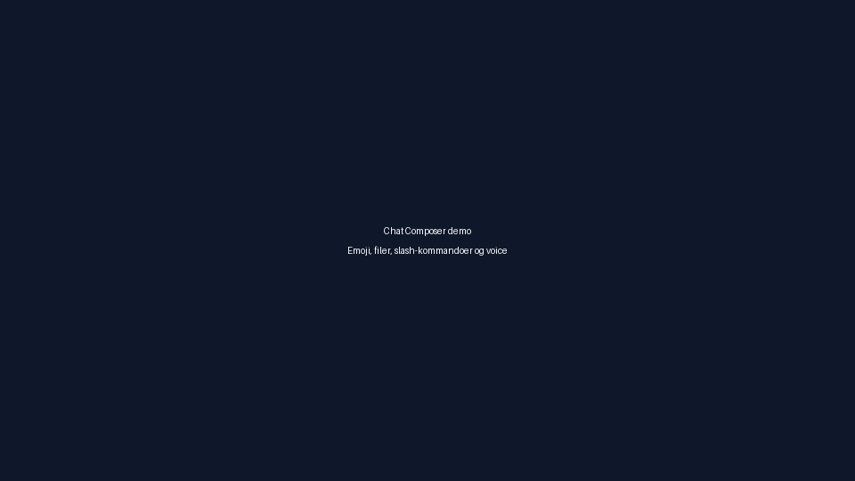

# Chat UI-kit

Dette dokumentet beskriver komponentene i det modulære chat-UI-kitet og hvordan de kan testes i utvikling.

## Komponenter

- **`ChatChannelList`** – viser kanaler med tilpasset profiltema, tilstedeværelse, uleste teller og mute-indikator.
- **`ChatThreadViewer`** – renderer meldinger med profilspesifikke gradienter, reaksjoner og tilstedeværelse.
- **`ChatReactionPicker`** – et animert grid for raske reaksjoner.
- **`PresenceBadge`** – et kompakt nærværsikon som justerer farge etter profiltema.
- **`ConnectionStatusBanner`** – informerer om nettverkstilstand og tilbyr «Forsøk igjen»-handling.

Alle komponentene finnes under `flutter_frontend/lib/ui/chat_kit/` og eksporteres samlet via `chat_kit.dart`. Tilhørende stories/demos er dokumentert i `ui_kit_stories.md`.

## Demo

En dedikert `ChannelListPage` demonstrerer komponentene i kombinasjon. Siden kan kjøres via `ChannelListPage`-ruten og viser både kanaloversikt og en trådvisning med dummydata.



## Stories

For rask visuell QA kan man bruke Flutter sin `run`-kommando mot `ChannelListPage`:

```bash
flutter run -d chrome lib/ui/pages/channel_list_page/channel_list_page.dart
```

Siden fungerer også som en referanse for tematisering: hver kanal får sitt eget `ChatProfileThemeData`-oppsett og det samme brukes for meldinger i trådvisningen.

## Testing

- Widget-tester (`test/features/chat/widgets/chat_composer_test.dart`) verifiserer emoji, kommandoer, vedlegg og taleopptak i `ChatComposer`.
- Integrasjonstesten (`test/features/chat/state/chat_view_model_offline_test.dart`) bekrefter at `ChatViewModel` henter meldinger fra cache ved nettverksbrudd.

## Responsive notater

Når vinduet er bredere enn 720 px vises kanal- og trådpanel side-om-side; ellers rendres en rulletbar liste først med kanaler og deretter tråden.
